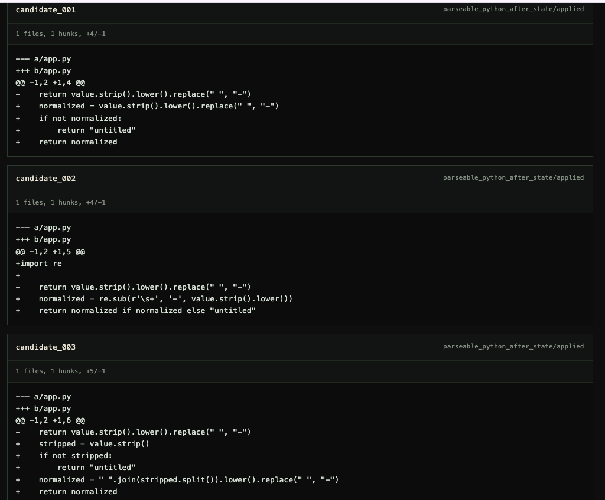
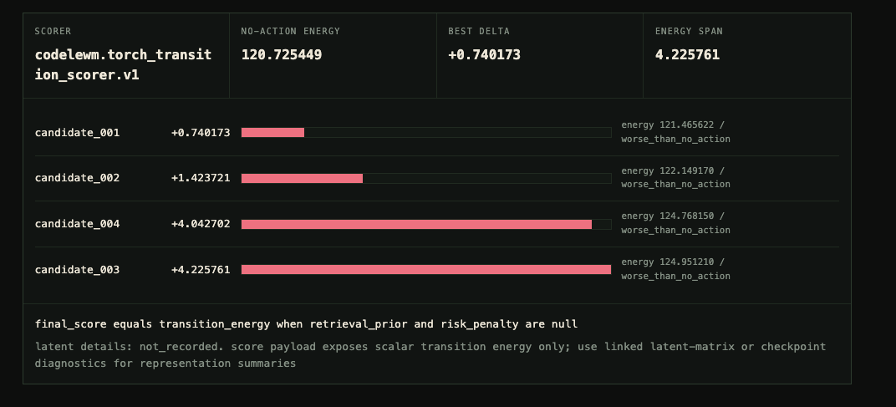
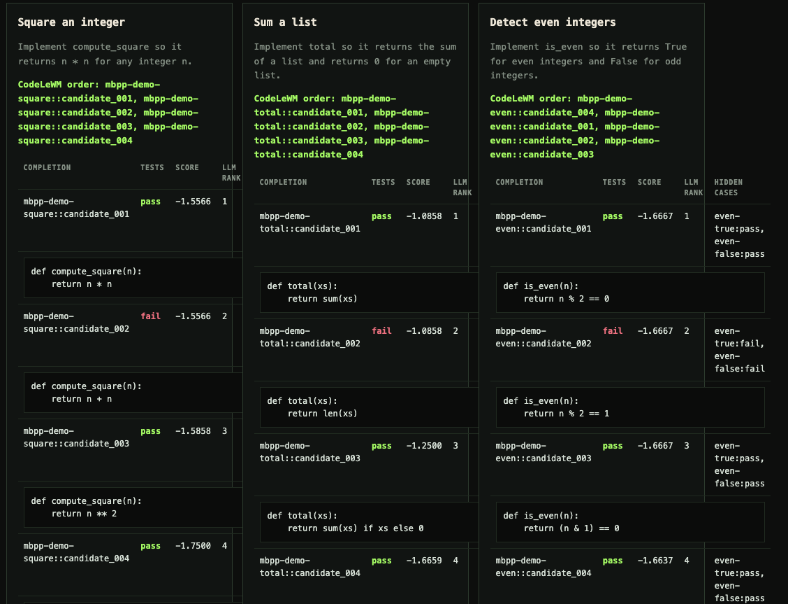
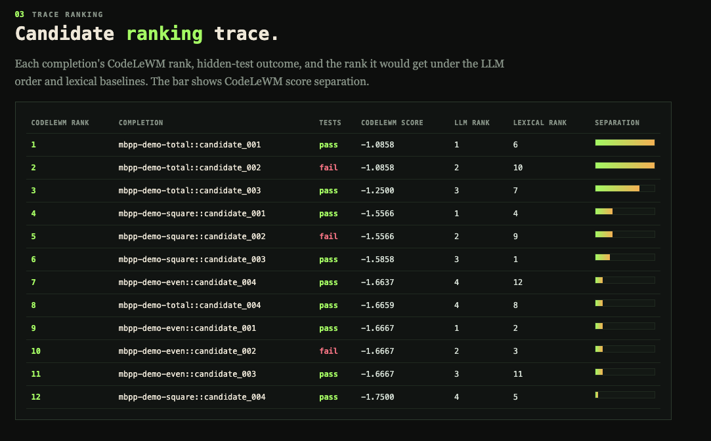

# CodeLeWM

<p align="center">
  
  
  
  <a href="https://huggingface.co/datasets/abdelstark/codelewm-execution-pack">
    
  </a>
  <a href="https://huggingface.co/abdelstark/codelewm-transition-model">
    
  </a>
  
  <a href="https://zenodo.org/records/20630120">
    
  </a>
  <a href="docs/papers/codelewm_final_paper.pdf">
    
  </a>
</p>

<p align="center"><strong>Claim-gated code world models for scoring and reranking candidate patches.</strong></p>

<p align="center">
CodeLeWM learns latent transition dynamics over Python code edits, then turns
those dynamics into reproducible scoring, retrieval, diagnostics, and LLM
candidate-reranking artifacts.
</p>

<table>
  <tr>
    <td width="50%">
      
      <br><sub>Candidate pack: generated patch options remain inspectable with parse/apply status.</sub>
    </td>
    <td width="50%">
      
      <br><sub>Scorer trace: transition energies compare candidates against the no-action baseline.</sub>
    </td>
  </tr>
  <tr>
    <td width="50%">
      
      <br><sub>Execution tour: task cards expose pass/fail labels, CodeLeWM order, and candidate code.</sub>
    </td>
    <td width="50%">
      
      <br><sub>Ranking trace: CodeLeWM, LLM-order, and lexical ranks are compared as diagnostic evidence.</sub>
    </td>
  </tr>
</table>

## What It Does

CodeLeWM models edit transitions:

```text
CodeState_before + EditAction -> latent(CodeState_after)
```

It is not a patch generator. It accepts candidate after-states or unified diffs
from a caller, codemod, search process, or LLM, then scores and reranks them
with a learned transition model and explicit baselines.

The package is built around four practical surfaces:

- data builders for public-safe Python edit transition datasets;
- package-native training and checkpoint manifests;
- retrieval, surprise, latent, scorer-quality, and downstream reranking evals;
- an LLM + world-model harness that captures untrusted candidate patches before
  scoring them.

## Install

```bash
uv sync --group dev
uv run codelewm --help
```

Optional runtimes stay explicit:

```bash
uv sync --group dev --group data          # HDF5 and Arrow dataset packing
uv sync --group dev --group train         # PyTorch training and scoring
uv sync --group dev --group eval          # optional evaluation helpers
uv sync --group dev --group llm           # OpenRouter candidate generation
uv sync --group dev --group observability # TensorBoard-compatible exports
uv sync --group dev --group tui           # optional Textual viewers
```

Full command reference: `docs/usage/USAGE.md`.

## Quickstart

Build the local smoke artifact set:

```bash
uv sync --group dev --group data --group train
uv run scripts/first-results --overwrite
uv run codelewm secret-scan \
  .artifacts/first-results \
  docs/benchmark/FIRST_RESULTS.md \
  --json
```

Run the fixture LLM + world-model demo:

```bash
uv sync --group dev --group data --group train --group llm
uv run scripts/llm-world-model-demo
```

Build the deterministic paper-demo artifact:

```bash
uv run scripts/paper-demo --out .artifacts/paper-demo --overwrite
```

These commands write schema-versioned artifacts under `.artifacts/`, verify
manifests where applicable, and keep publishable outputs compatible with the
secret scanner.

## Architecture

```text
                         CodeLeWM package

  raw edits / fixtures / public shards
                 |
                 v
        +-------------------+
        | codelewm.data     |  source policy, parsing, normalization,
        |                   |  dedup, splits, transition manifests
        +---------+---------+
                  |
                  v
        +-------------------+       +--------------------+
        | TransitionRecord  +------>| HDF5 / artifact    |
        | before/action/after       | packs + manifests  |
        +---------+---------+       +--------------------+
                  |
                  v
        +-------------------+
        | codelewm.model    |  CodeStateEncoder, action encoders,
        |                   |  JEPA-style predictor, transition energy
        +---------+---------+
                  |
                  v
        +-------------------+       +--------------------+
        | codelewm.eval     +------>| reports: retrieval,|
        |                   |       | surprise, latent,  |
        |                   |       | downstream gates   |
        +---------+---------+       +--------------------+
                  |
                  v
        +-------------------+
        | codelewm.harness  |  score, rerank, index, LLM demo,
        |                   |  HTML/terminal/TUI view models
        +-------------------+
```

Load-bearing rules:

- candidate code is untrusted input;
- parsing and scoring do not execute candidate patches by default;
- every publishable artifact is JSON-native where applicable, manifest-backed,
  checksum-verifiable, and secret-scanned;
- public model-quality claims are opened by reports, not by demos.

## Training Paradigm

CodeLeWM uses a JEPA-style latent transition objective for code edits. The model
predicts the after-state latent from the before-state latent and action latent;
transition energy is the distance between the predicted and observed after
latents.

```text
                 training row
  +-----------------------------------------+
  | before code | edit action | after code  |
  +------+------+-+-----------+-+-----------+
         |        |             |
         v        v             v
  +-------------+ +-------------+ +-------------+
  | CodeState   | | Text/       | | CodeState   |
  | Encoder     | | Abstract    | | Encoder     |
  +------+------+ | Action Enc. | +------+------+
         |        +------+------+        |
         |               |               |
         v               v               v
     z_before       action_latent     z_after
         \               |              /
          \              v             /
           +----> latent predictor ---+
                         |
                         v
                   z_after_pred
                         |
             +-----------+-----------+
             | transition loss       |
             | SIGReg/collapse gates |
             | retrieval diagnostics |
             +-----------+-----------+
                         |
                         v
          checkpoint + manifest + eval reports
```

Reproducible training and publication use the same outer loop:

```text
source acquisition
  -> license and split gates
  -> transition shards
  -> packed training batches
  -> package-native torch training
  -> trusted checkpoint manifest
  -> downloaded-artifact verification
  -> retrieval / surprise / latent / rerank reports
  -> claim-gated public wording
```

## LLM + World-Model Harness

The harness is designed for the practical workflow where an LLM proposes
candidate patches and CodeLeWM evaluates them as code-edit transitions.

```text
  task + bounded repository context
              |
              v
     +-------------------+
     | OpenRouter / LLM  |  dry-run fixtures by default,
     | candidate writer  |  live mode via OPENROUTER_API_KEY
     +---------+---------+
               |
               v
     +-------------------+
     | candidate pack    |  untrusted diffs, checksums,
     | codelewm.llm_*    |  parse/apply status, redaction
     +---------+---------+
               |
      +--------+---------+
      |                  |
      v                  v
+-------------+   +-------------------+
| static      |   | CodeLeWM scorer   |
| patch view  |   | trusted checkpoint|
+------+------+   +---------+---------+
       \                  /
        \                /
         v              v
     +-----------------------+
     | rerank report         |
     | LLM order, no-action, |
     | lexical, CodeLeWM     |
     +-----------+-----------+
                 |
                 v
     terminal / HTML / JSON / optional TUI
```

Run the default fixture path:

```bash
uv run scripts/llm-world-model-demo
```

Run live candidate generation through OpenRouter:

```bash
cp .env.example .env
# Fill OPENROUTER_API_KEY locally. Keep .env untracked.
CODELEWM_LLM_DRY_RUN=0 uv run scripts/llm-world-model-demo
```

Anthropic BYOK is explicit and routed through OpenRouter:

```bash
uv run codelewm openrouter byok-register \
  --provider anthropic \
  --key-env ANTHROPIC_API_KEY \
  --management-key-env OPENROUTER_MANAGEMENT_KEY \
  --name "CodeLeWM Anthropic BYOK" \
  --allowed-model anthropic/claude-4.5-sonnet \
  --dry-run \
  --json
```

Raw provider keys are never written to reports; reports serialize only redacted
BYOK metadata.

## Python API

Score one candidate:

```python
from pathlib import Path
from codelewm.harness import load_scorer

scorer = load_scorer(
    Path(".artifacts/first-results/train/checkpoints/checkpoint.pt"),
    device="cpu",
)
result = scorer.score_files(
    before=Path("tests/fixtures/codestate/class_method_before.py"),
    instruction="rewrite the accumulator update explicitly",
    candidate=Path("config/first_results/scorer_quality_candidates/true_after.py"),
)
print(result.to_dict())
```

Rerank a candidate directory:

```python
from pathlib import Path
from codelewm.harness import load_scorer

result = load_scorer(
    Path(".artifacts/first-results/train/checkpoints/checkpoint.pt")
).rerank_files(
    before=Path("tests/fixtures/codestate/class_method_before.py"),
    instruction="rewrite the accumulator update explicitly",
    candidates=Path("config/first_results/scorer_quality_candidates"),
)

for item in result.results:
    if hasattr(item, "final_score"):
        print(item.candidate, item.final_score)
    else:
        print(item.artifact, item.error_type, item.message)
```

## CLI Surface

| Need | Command |
| --- | --- |
| Build transition data | `codelewm dataset build` |
| Pack training batches | `codelewm dataset pack` |
| Train a transition model | `codelewm train` |
| Score one candidate | `codelewm score` |
| Rerank many candidates | `codelewm rerank` |
| Build a transition index | `codelewm index` |
| Run retrieval eval | `codelewm eval retrieval` |
| Run surprise eval | `codelewm eval surprise` |
| Inspect latent matrices | `codelewm eval latent-matrix` |
| Evaluate scorer quality | `codelewm eval scorer-quality` |
| Build downstream rerank packs | `codelewm eval downstream-pack` |
| Evaluate downstream reranking | `codelewm eval downstream-rerank` |
| Run the LLM harness | `codelewm llm-demo` |
| Register OpenRouter BYOK | `codelewm openrouter byok-register` |
| Verify lineage | `codelewm manifest verify` |
| Scan publishable artifacts | `codelewm secret-scan` |

## Artifact Contract

CodeLeWM treats artifacts as part of the API:

- manifests record command, config, source git SHA, checksums, and parent
  artifacts;
- checkpoint loading goes through trust gates before model-backed scoring;
- reports use stable schema names such as `codelewm.eval.retrieval_report.v1`,
  `codelewm.llm_candidate_pack.v1`, and `codelewm.rerank.v1`;
- documentation cards and benchmark reports link public artifacts to the exact
  commands that produced them.

Useful entry points:

- final paper source: `docs/papers/codelewm_final_paper.tex`;
- final paper PDF: `docs/papers/codelewm_final_paper.pdf`;
- usage guide: `docs/usage/USAGE.md`;
- paper-demo artifact set: `docs/benchmark/v1_0/paper_demo`;
- paper-demo artifact note:
  `docs/benchmark/PAPER_DEMO_V1_0_ARTIFACTS_2026-06-08.md`;
- final claim audit: `docs/benchmark/V1_0_FINAL_CLAIM_AUDIT_2026-06-08.md`;
- public artifact index: `docs/benchmark/PUBLIC_ARTIFACT_INDEX_2026-06-08.md`;
- Hugging Face execution dataset:
  `https://huggingface.co/datasets/abdelstark/codelewm-execution-pack`;
- Hugging Face transition-model artifacts:
  `https://huggingface.co/abdelstark/codelewm-transition-model`;
- Hugging Face run artifacts:
  `https://huggingface.co/datasets/abdelstark/codelewm-runs`;
- reproducibility checklist:
  `docs/release/V1_0_REPRODUCIBILITY_CHECKLIST_2026-06-08.md`.
- release announcement: `docs/announcements/FINAL_V1_0_RELEASE_2026-06-08.md`.

<!-- docs-contract: #406 consolidated benchmark tables; #407 rewrote the paper; #408 published the final artifact index. -->

## Claim Contract

CodeLeWM is deliberately claim-gated. Runnable demos, green manifests, and
published artifacts are necessary evidence, but they do not automatically imply
model-quality or coding-usefulness claims.

Supported wording:

- reproducible code-edit world-model harness;
- manifest-backed public artifacts;
- negative action-use evidence for the tested action-conditioned checkpoints;
- narrow HumanEval WS-D reranking slice in the checked-in replay evidence.

Blocked wording:

- broad coding improvement;
- live patch utility;
- validated semantic latent axes;
- general downstream improvement across benchmarks.

The detailed audit lives in
`docs/benchmark/V1_0_FINAL_CLAIM_AUDIT_2026-06-08.md`.

## Development

```bash
uv sync --group dev
uv run python -m pytest tests/
uv run python -m compileall -q -x 'tests/fixtures/codestate/invalid_(before|after)\.py$' codelewm tests
uv run codelewm --help
```

Package and artifact gates are documented in `CONTRIBUTING.md` and
`docs/release/RELEASE_CHECKLIST.md`.

## Attribution

CodeLeWM starts from the LeWorldModel codebase and keeps its JEPA-style model
shape as the implementation seed:

```bibtex
@article{maes_lelidec2026lewm,
  title={LeWorldModel: Stable End-to-End Joint-Embedding Predictive Architecture from Pixels},
  author={Maes, Lucas and Le Lidec, Quentin and Scieur, Damien and LeCun, Yann and Balestriero, Randall},
  journal={arXiv preprint},
  year={2026}
}
```
